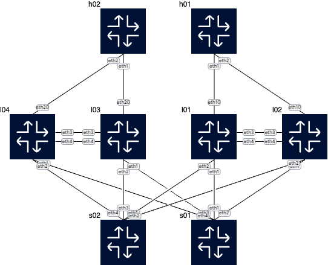

# CVaaS + AVD Demo — EVPN MLAG (L2LS)

Laboratorium demonstrujące integrację **Arista Validated Designs (AVD)** z **CloudVision as a Service (CVaaS)** na topologii EVPN MLAG uruchamianej w [containerlab](https://containerlab.dev/).

> **Dane dostępowe do urządzeń**  
> Login: `arista` | Hasło: `arista`

---

## Topologia



Sieć składa się z 8 węzłów cEOS-lab:

| Hostname | Rola | OS | Management IP |
|----------|------|----|---------------|
| s01 | Spine | cEOS-lab 4.34.2F | 10.0.1.1 |
| s02 | Spine | cEOS-lab 4.34.2F | 10.0.1.2 |
| l01 | L3Leaf (pod0, MLAG) | cEOS-lab 4.34.2F | 10.0.2.1 |
| l02 | L3Leaf (pod0, MLAG) | cEOS-lab 4.34.2F | 10.0.2.2 |
| l03 | L3Leaf (pod1, MLAG) | cEOS-lab 4.34.2F | 10.0.2.3 |
| l04 | L3Leaf (pod1, MLAG) | cEOS-lab 4.34.2F | 10.0.2.4 |
| h01 | Host | cEOS-lab 4.34.2F | 10.0.3.1 |
| h02 | Host | cEOS-lab 4.34.2F | 10.0.3.2 |

Sieć szkieletowa: **EVPN MLAG**, dwie pary leaf-ów w MLAG peer-link, uplinki do dwóch spine-ów (eBGP underlay + EVPN overlay).

---

## Wymagania

### Narzędzia

| Narzędzie | Minimalna wersja |
|-----------|-----------------|
| containerlab | 0.54+ |
| Docker | 20.10+ |
| Ansible | core 2.17+ |
| `arista.avd` collection | 5.2+ |
| `arista.eos` collection | 10.0+ |
| `pyavd` | 5.2+ |

```bash
# Instalacja kolekcji AVD
ansible-galaxy collection install arista.avd arista.eos arista.cvp
pip3 install pyavd
```

### Obraz cEOS-lab

Wymagany obraz: **`arista/ceos:4.34.2F`** (lub nowszy, tagowany jako `latest`).

```bash
# Sprawdź dostępne obrazy
docker images arista/ceos

# Jeśli latest != 4.34.2F, retag:
docker tag arista/ceos:4.34.2F arista/ceos:latest
```

Obraz cEOS-lab dostępny po rejestracji na [arista.com](https://www.arista.com/en/support/software-download).

### Tokeny CVaaS (wymagane do integracji z CloudVision)

Umieść dwa pliki tokenów w katalogu `clab/` (są w `.gitignore` — nie trafią do repo):

| Plik | Cel | Skąd pobrać |
|------|-----|-------------|
| `clab/cv-onboarding-token` | Rejestracja urządzeń w CVaaS przez TerminAttr | CVaaS → Provisioning → Token Management |
| `clab/cv-api-token` | AVD → CloudVision API (`make deploy_cvp`) | CVaaS → Settings → Access Control → Service Accounts |

```bash
echo "<twój-onboarding-token>"    > clab/cv-onboarding-token
echo "<twój-service-account-token>" > clab/cv-api-token
```

---

## Konfiguracja — docelowy tenant CVaaS

Domyślna konfiguracja wskazuje na klaster **`cv-prod-euwest-2`**.  
Jeśli korzystasz z innego tenanta, zmień adres serwera w:

- `clab/init-configs/*.cfg` — parametr `-cvaddr=` w daemonie TerminAttr
- `avd_inventory/inventory.yml` — `ansible_host` w grupie `CV_SERVERS`
- `avd_inventory/group_vars/all.yml` — `cv_settings.cvaas.clusters[].region`
- `avd_inventory/playbooks/avd_deploy_cvp.yml` — domyślna wartość `CVURL`

---

## Uruchomienie krok po kroku

### 1. Uruchom topologię containerlab

```bash
make start
```

Uruchamia 8 kontenerów cEOS z konfiguracją bazową. Urządzenia automatycznie rejestrują się w CVaaS przez TerminAttr (wymaga pliku `clab/cv-onboarding-token`).

Sprawdź stan:
```bash
make inspect
```

Dostęp do urządzenia przez SSH:
```bash
ssh arista@10.0.1.1   # s01
ssh arista@10.0.2.1   # l01
# lub po uruchomieniu addAliases.sh: s01, l01, l02 ...
```

### 2. Wygeneruj konfiguracje AVD

```bash
make build
```

AVD (`eos_designs` + `eos_cli_config_gen`) generuje:
- `avd_inventory/intended/configs/*.cfg` — gotowe konfiguracje urządzeń
- `avd_inventory/intended/structured_configs/*.yml` — structured configs
- `avd_inventory/documentation/` — dokumentacja fabric

### 3a. Deployuj przez eAPI (bez CVaaS)

```bash
make deploy
```

AVD wgrywa konfiguracje bezpośrednio przez HTTPS/eAPI do każdego urządzenia.

### 3b. Deployuj przez CloudVision (CVaaS)

```bash
make deploy_cvp
```

AVD tworzy Workspace w CVaaS i wgrywa konfiguracje przez CloudVision API.  
Token jest automatycznie czytany z `clab/cv-api-token`.

Możesz nadpisać ustawienia zmiennymi środowiskowymi:
```bash
CVURL=www.cv-prod-euwest-2.arista.io \
CV_API_TOKEN=$(cat clab/cv-api-token) \
make deploy_cvp
```

### 4. Walidacja stanu sieci

```bash
make test
```

AVD (`eos_validate_state`) weryfikuje stan BGP, interfejsów, MLAG, EVPN.

### 5. Weryfikacja ręczna — komendy diagnostyczne

Po deployu możesz sprawdzić stan protokołów bezpośrednio na urządzeniach (np. przez SSH lub `docker exec`):

#### BGP Underlay (IPv4)

```
show ip bgp summary
```

Sprawdza sesje eBGP IPv4 między spine a leaf. Wszystkie sesje powinny być w stanie `Estab`.

#### BGP EVPN Overlay

```
show bgp evpn summary
```

Weryfikuje sesje eBGP EVPN między leaf a spine (overlay). Spine pełni rolę route-reflector.

#### Prefiksy IP propagowane przez EVPN (type-5)

```
show bgp evpn route-type ip-prefix ipv4
```

Wyświetla trasy IP (type-5 IP Prefix) rozgłaszane przez EVPN — widoczne po poprawnym skonfigurowaniu VRF i redistribucji.

#### MAC/IP bindings (type-2)

```
show bgp evpn route-type mac-ip
```

Pokazuje wpisy MAC+IP (type-2) nauczone z VXLAN — weryfikacja działania EVPN L2.

---

### 6. Sprawdź diff przed deployem

```bash
make diff
```

Pokazuje różnicę między konfiguracją running a zaprojektowaną przez AVD (dry-run, bez zmian).

### 7. Zatrzymaj lab

```bash
make stop
```

Niszczy kontenery i usuwa pliki runtime containerlab.

---

## Dostępne komendy Makefile

| Komenda | Opis |
|---------|------|
| `make start` | Uruchom topologię containerlab |
| `make stop` | Zatrzymaj i usuń lab |
| `make inspect` | Sprawdź stan węzłów i adresy management |
| `make build` | Wygeneruj konfiguracje AVD |
| `make deploy` | Wgraj konfiguracje przez eAPI |
| `make deploy_cvp` | Wgraj konfiguracje przez CVaaS |
| `make diff` | Pokaż diff running vs designed (dry-run) |
| `make test` | Walidacja stanu sieci |

---

## Aliasy SSH

```bash
bash addAliases.sh && source ~/.zshrc
# Potem wystarczy wpisać: s01, s02, l01, l02, l03, l04, h01, h02
```

---

## Struktura repozytorium

```
.
├── Makefile
├── topology.clab.png            # Diagram topologii
├── addAliases.sh                # Aliasy SSH do urządzeń
├── clab/
│   ├── topology.clab.yml        # Definicja topologii containerlab
│   ├── init-configs/            # Bazowe konfiguracje urządzeń (startup)
│   ├── sn/                      # Pliki serial number dla cEOS
│   ├── interface_mapping.json   # Mapowanie interfejsów cEOS
│   ├── cv-onboarding-token      # [gitignore] Token onboardingu CVaaS
│   └── cv-api-token             # [gitignore] Token API CVaaS (service account)
└── avd_inventory/
    ├── ansible.cfg
    ├── inventory.yml
    ├── group_vars/
    │   ├── all.yml              # Zmienne globalne (mgmt, NTP, AAA, CVaaS)
    │   ├── AVD_FABRIC.yml       # Definicja spine/leaf, BGP AS, pule IP
    │   ├── AVD_FABRIC_LEAFS.yml
    │   ├── AVD_FABRIC_ENDPOINTS.yml
    │   └── AVD_FABRIC_TENANTS.yml
    ├── playbooks/
    │   ├── avd_build.yml
    │   ├── avd_deploy.yml
    │   ├── avd_deploy_cvp.yml
    │   └── avd_validate.yml
    └── intended/                # [auto-generated] Konfiguracje wygenerowane przez AVD
```

---

## Odnośniki

- [Arista AVD Documentation](https://avd.arista.com)
- [containerlab Documentation](https://containerlab.dev)
- [CVaaS Documentation](https://www.arista.com/en/cg-cv/cv-cloudvision-as-a-service)
