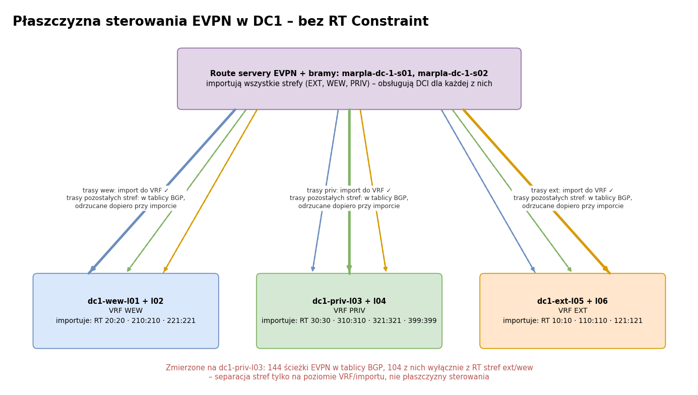
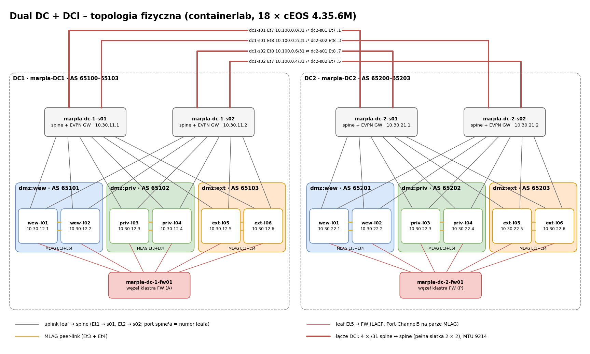
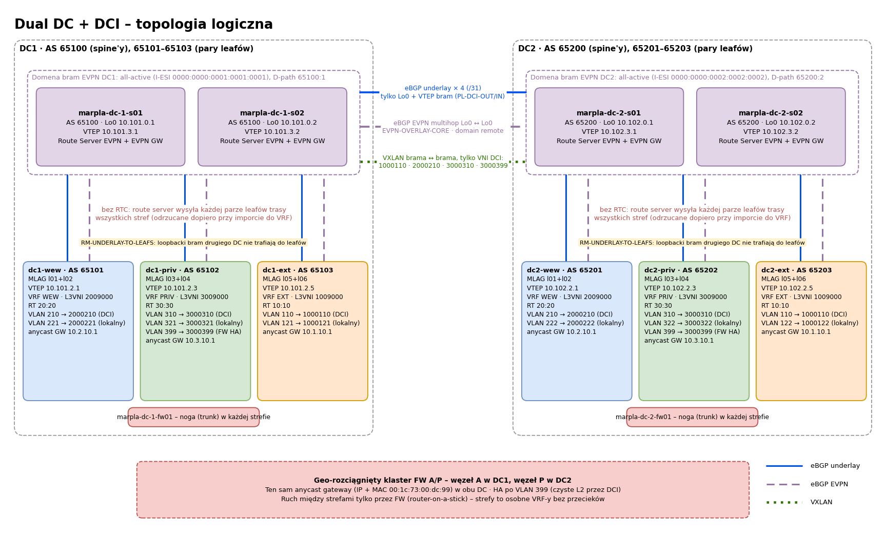

# Dual DC + DCI – multi-domain: każda strefa jest osobną domeną EVPN

> **Gałąź `multi-domain`** – wariant A: bramą EVPN każdej strefy bezpieczeństwa jest **jej własna para
> leafów**. Każda strefa ma osobne sesje EVPN i osobne tunele VXLAN przez DCI, a spine'y są już tylko
> route serverami EVPN i tranzytem underlay – bez VTEP-a i bez VRF-ów stref.

| Gałąź | Zawartość |
|---|---|
| `main` | lab jednego DC (L2LS, EVPN MLAG) + CVaaS |
| `dualDCandDCI` | gałąź rozwojowa dual DC – stan bez RTC z pełną dokumentacją (draw.io) |
| `single-domain` | dual DC, wspólne bramy (spine'y) dla wszystkich stref, bez RTC |
| `single-domain-with-rtc` | jak `single-domain` + RT Constraint |
| **`multi-domain`** | **ta gałąź**: bramy per strefa na parach leafów, osobne domeny EVPN, RTC |

## Czym różni się od wariantów single-domain

| | `single-domain` | `single-domain-with-rtc` | **`multi-domain`** |
|---|---|---|---|
| brama EVPN | spine'y, wspólne dla wszystkich stref | spine'y, wspólne | **para leafów każdej strefy** |
| spine'y | RS + VTEP + VRF-y wszystkich stref | jak obok | **tylko route server + tranzyt DCI** (bez VTEP i VRF) |
| sesje EVPN przez DCI | 4 (spine ↔ spine), wszystkie strefy | jak obok | **osobne per strefa** (para ↔ para tej samej strefy) |
| tunele VXLAN przez DCI | brama ↔ brama | jak obok | **para ↔ para tej samej strefy** |
| tablica EVPN leafa | trasy wszystkich stref | tylko jego strefa | tylko jego strefa |
| gdzie strefy się spotykają | bramy + tablice leafów | bramy (spine'y) | **tylko route servery własnego DC** (bez importu, bez VRF) |

Awaria, zmiana albo pomyłka konfiguracyjna w jednej strefie dotyczy wyłącznie jej pary leafów i jej sesji
DCI – pozostałe strefy mają własne bramy, sesje i tunele.



### Co pokazuje lab (`marpla-dc-1-priv-l03`)

```
marpla-dc-1-priv-l03# show bgp evpn summary
  Description              Neighbor   V AS     ... State   PfxRcd PfxAcc PfxAdv
  marpla-dc-1-s01_Loopback 10.101.0.1 4 65100  ... Estab   0      0      10
  marpla-dc-1-s02_Loopback 10.101.0.2 4 65100  ... Estab   0      0      10
  marpla-dc-2-priv-l03     10.102.1.3 4 65202  ... Estab   7      7      7
  marpla-dc-2-priv-l04     10.102.1.4 4 65202  ... Estab   7      7      7

marpla-dc-1-priv-l03# show vxlan vtep
10.102.2.3       unicast, flood
Total number of remote VTEPS:  1

marpla-dc-1-priv-l03# show bgp evpn extcommunity rt 210:210 route-type mac-ip
          Network                Next Hop              Metric  LocPref Weight  Path
```

- Sesje EVPN: 2 route servery DC1 i **tylko** para priv z DC2 (`EVPN-OVERLAY-CORE`, `domain remote`).
- Od route serverów leaf dostaje 0 prefiksów – jest jedyną parą priv w DC1; wszystkie trasy swojej strefy
  dostaje bezpośrednio od pary priv DC2.
- Jedyny zdalny VTEP to para priv w DC2 (`10.102.2.3`) – tunel VXLAN para ↔ para.
- Trasy strefy wew (`RT 210:210`) w ogóle do leafa priv nie docierają.

| Urządzenie | ścieżki EVPN z RT w tablicy BGP |
|---|---|
| `marpla-dc-1-priv-l03` | 46 – wszystkie strefy priv |
| `marpla-dc-1-wew-l01` | 37 – wszystkie strefy wew |
| `marpla-dc-2-ext-l05` | 37 – wszystkie strefy ext |
| `marpla-dc-1-s01` (route server) | 52 – trasy trzech stref, ale tylko z DC1; nie ma VXLAN ani VRF-ów stref |

### Które RT należą do której strefy

| Strefa | RT VRF (L3VNI) | RT VLAN-ów |
|---|---|---|
| `ext` | `10:10` – VRF EXT (1009000) | `110:110` FW, rozciągnięty · `121:121` lokalny DC1 · `122:122` lokalny DC2 |
| `wew` | `20:20` – VRF WEW (2009000) | `210:210` FW, rozciągnięty · `221:221` lokalny DC1 · `222:222` lokalny DC2 |
| `priv` | `30:30` – VRF PRIV (3009000) | `310:310` FW, rozciągnięty · `321:321` lokalny DC1 · `322:322` lokalny DC2 · `399:399` FW HA |

RD trasy kończy się tym samym numerem (`<Lo0>:<VLAN>` / `<Lo0>:<vrf_id>`), więc strefę widać po RD.

### Pułapka RT Constraint w multi-domain (i jak ją rozwiązano)

Samo `evpn_overlay_bgp_rtc: true` tu **nie wystarcza**. Route servery ogłaszają leafom członkostwo
„wyślij mi wszystko” (`0/0`, `default-route-target only`). Brama strefy przekazywała je przez sesję core do
bramy w drugim DC, a ta – do swoich route serverów, które uznawały, że leaf chce tras wszystkich stref
(zmierzone: leaf ext miał 124 ze 161 ścieżek z innych stref). Wyłączenie RTC na sesjach core też nie pomaga –
router z peerem bez RTC musi sam ogłaszać `0/0`.

Rozwiązanie: brama ogłasza tylko członkostwo, które **sama generuje** (pusty AS path) – RT swojej strefy:

```
ip as-path access-list AS-RTC-LOCAL permit ^$ any
route-map RM-RTC-LOCAL-ONLY permit 10
   match as-path AS-RTC-LOCAL
router bgp 65102
   address-family rt-membership
      neighbor EVPN-OVERLAY-PEERS route-map RM-RTC-LOCAL-ONLY out
      neighbor EVPN-OVERLAY-CORE route-map RM-RTC-LOCAL-ONLY out
```

(AVD nie ma klucza na route-mapę w `address_family_rtc`, więc te dwie linie są w `raw_eos_cli` per para.)

## Topologia

Fizycznie bez zmian względem wariantów single-domain: dwa ośrodki, po 2 spine'y i 3 pary MLAG leafów
(`wew`, `priv`, `ext`), DCI = 4 łącza /31 między spine'ami, węzeł klastra FW A/P w każdym DC.





## Konfiguracja w skrócie

| Element | Wartość |
|---|---|
| ASN | DC1: spine'y 65100, pary leafów 65101 (wew) / 65102 (priv) / 65103 (ext); DC2: 65200, 65201–65203 |
| Spine'y | domyślny typ węzła AVD: route server EVPN (next-hop-unchanged), bez VTEP, bez VRF-ów |
| Bramy | `evpn_gateway` na `node_group` każdej strefy – EVPN L2 + L3 inter-domain, `remote_peers` = para tej samej strefy w drugim DC |
| Overlay DCI | eBGP EVPN multihop Lo0 ↔ Lo0 para ↔ para (`EVPN-OVERLAY-CORE`, `domain remote`), osobno dla każdej strefy |
| Underlay DCI | eBGP po 4 × /31 spine ↔ spine, prefix-listy `PL-DCI-IN/OUT` – tylko Lo0 + VTEP leafów |
| Przez DCI (L2) | tylko VNI 1000110, 2000210, 3000310, 3000399; VLAN-y lokalne mają `evpn_l2_multi_domain: false` |
| Przez DCI (L3) | type-5 VRF-ów stref (`next-hop-self … inter-domain`) – podsieci lokalne drugiego DC osiągalne routingiem |
| D-path / ES | brak – AVD generuje je tylko z all-active multihoming (niedostępne z MLAG); pętlę blokuje AS path drugiego leafa pary |
| RTC | `evpn_overlay_bgp_rtc: true` + `RM-RTC-LOCAL-ONLY` na bramach (opis wyżej) |
| L2VNI / RT | baza strefy + VLAN (ext 100xxxx, wew 200xxxx, priv 300xxxx); RT `<VLAN>:<VLAN>`, VRF 10:10 / 20:20 / 30:30 |
| Anycast GW | ten sam IP i MAC `00:1c:73:00:dc:99` w obu DC |
| Tagi CloudVision | `owner:marpla`, `dmz:<strefa>`; hierarchia `marpla-DCx` → `marpla-DCx-POD1` → rack = para leafów |

Pełny opis (VLAN-y, adresacja, okablowanie, pliki): [dual_dc/README.md](dual_dc/README.md);
diagram edytowalny (fizyczny, logiczny, P2P per DC, RD i RT ze ścieżką trasy): [dual_dc/topology.drawio](dual_dc/topology.drawio).

## Uruchomienie

```bash
cd dual_dc
make start        # containerlab: 18 × cEOS 4.35.6M, sieć mgmt 10.30.0.0/16
make build        # AVD (DC1 i DC2 jako osobne fabrici) + katalog testów multi-domain
make deploy_cvp   # przez CVaaS, change control zatwierdzany i uruchamiany automatycznie – albo: make deploy (eAPI)
make test         # fw_test + ANTA: katalogi AVD i testy BGP/EVPN/DCI/RTC
make test_dci     # fw_test + tylko testy BGP/EVPN/DCI/RTC
make stop         # po decommission urządzeń w CVaaS
```

Obraz cEOS: `./get_ceos.sh -v 4.35.6M` (wymaga `ARISTA_TOKEN`). Raporty ANTA: `dual_dc/avd/anta/reports/`.

## Wyniki testów

Uruchomione 2026-10-06 na labie z wdrożoną konfiguracją tej gałęzi (`make deploy_cvp`, potem `make test`).

**`fw_test`** – 20/20: z obu węzłów FW anycast GW w każdej strefie (VLAN rozciągnięty i lokalny),
drugi węzeł FW przez DCI w każdej strefie oraz VLAN HA 399.

**Testy multi-domain** (`dual_dc/avd/anta_catalogs/dci_tests.yml`) – **100/100**:

| Test | Wynik | Co potwierdza |
|---|---|---|
| `VerifyBGPPeerSession`, `VerifyBGPPeerCount` | 32/32 | wszystkie sesje; leaf: 4 EVPN (2 RS + 2 bramy tej samej strefy w drugim DC), 4 rt-membership, 3 IPv4; spine: 6 EVPN, 8 IPv4 |
| `VerifyVxlanVtep` | 12/12 | jedyny zdalny VTEP leafa = para tej samej strefy w drugim DC |
| `VerifyVxlanVniBinding` | 12/12 | na parze tylko VNI jej strefy |
| `VerifyEVPNRoutesMatchImportedRT` (własny test) | 12/12 | tablica BGP EVPN leafa zawiera tylko trasy z RT jego strefy |
| `VerifyEVPNType5Routes`, `VerifyEVPNType2Route` | 24/24 | podsieć lokalna i FW drugiego DC docierają przez bramę strefy |
| `VerifyBgpRouteMaps`, `VerifyBGPExchangedRoutes` | 8/8 | route-mapy DCI; przez DCI wymieniane są loopbacki leafów (oba łącza, ECMP) |

Przed poprawką RTC (bez `RM-RTC-LOCAL-ONLY`) test `VerifyEVPNRoutesMatchImportedRT` był czerwony na wszystkich
12 leafach – to on wykrył opisaną wyżej pułapkę.

**Pełny `make test`** (katalogi AVD + multi-domain) – 492 testy: **448 OK, 44 znane odstępstwa**, wszystkie
wynikające ze środowiska cEOS lub z projektu, nie z błędu konfiguracji:

| Test | Liczba | Przyczyna |
|---|---|---|
| `VerifyLoggingErrors` | 16 | cEOS-lab loguje przy starcie `HARDWARE-0-SYSTEM_IDENTIFICATION_FAILED` |
| `VerifyInterfaceDiscards` | 16 | odrzucane pakiety na `Management1` (sieć zarządzania Dockera) |
| `VerifyVxlanConfigSanity` | 12 | VLAN-y lokalne (x21/x22) istnieją tylko na jednej parze leafów, więc ich flood list jest pusta – EOS raportuje to jako ostrzeżenie |

Pozostałe kategorie (BGP, MLAG, routing, STP, łączność, system, konfiguracja) – bez błędów.

## Lab jednego DC

Lab z gałęzi `main` (`clab/`, `avd_inventory/`, `Makefile` w katalogu głównym) jest nadal w repozytorium
bez zmian – jego opis jest w README na gałęzi `main`.
